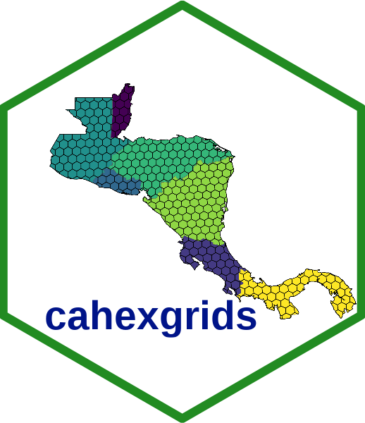

<!-- README.md is generated from README.Rmd. Please edit that file -->

```{r, include = FALSE}
knitr::opts_chunk$set(
  collapse = TRUE,
  comment = "#>",
  fig.path = "man/figures/README-",
  out.width = "100%"
)
```

# cahexgrids 

<!-- badges: start -->
<!-- badges: end -->

The goal of cahexgrids is to provides a hierarchical geospatial hexagonal grid indexing system for Central America

Hexagonal grid resolution are 4, 5, 6, 7 y 8 (based in [H3](https://h3geo.org)

## Installation

You can install the development version of cahexgrids from [GitHub](https://github.com/) with:

``` r
# install.packages("devtools")
devtools::install_github("ManuelSpinola/cahexgrids")
```

## Example

This is a basic example which shows you how to use cahexgrids:

```{r, message=FALSE, warning=FALSE}
library(tidyverse)
library(sf)
library(cahexgrids)
```


```{r}
#| fig-cap: "Figura 1. Hexagonal grid of resolution 4 for Central America."
ggplot(ca_hex_grid_res_4) +
  geom_sf(fill = "dodgerblue3", color = "gray") +
  theme_minimal()
```

<br>

```{r}
#| fig-cap: "Figura 2. Hexagonal grid of resolution 5 for Central America."
ggplot(ca_hex_grid_res_5) +
  geom_sf(fill = "dodgerblue3", color = "gray") +
  theme_minimal()
```

<br>

```{r}
#| fig-cap: "Figura 3. Hexagonal grid of resolution 6 for Central America."
ggplot(ca_hex_grid_res_6) +
  geom_sf(fill = "dodgerblue3", color = "gray") +
  theme_minimal()
```

<br>


```{r}
#| echo: false
#| fig-cap: "Figura 4. Hierarchical hexagonal grids of resolution 5, 6, 7, 8. Every hexagonal cell has seven child cells below it in this hierarchy.  "
ggplot() +
  theme_minimal() +
  geom_sf(data = ca_hex_grid_res_4, fill = NA, color = "red", linewidth = 0.8, alpha = 0.2) +
  geom_sf(data = ca_hex_grid_res_5, fill = NA, color = "blue", linewidth = 0.8) +
  geom_sf(data = ca_hex_grid_res_6, fill = NA, color = "black", linewidth = 0.4) +
  geom_sf(data = ca_hex_grid_res_7, fill = NA, color = "green", linewidth = 0.4) +
  coord_sf(xlim = c(-90.3, -89.5), ylim = c(13.95, 14.5))
```


