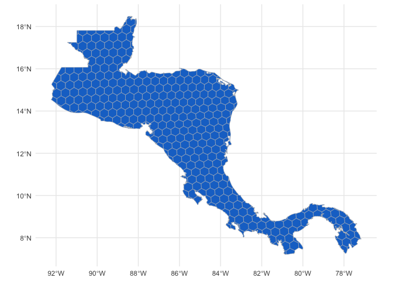
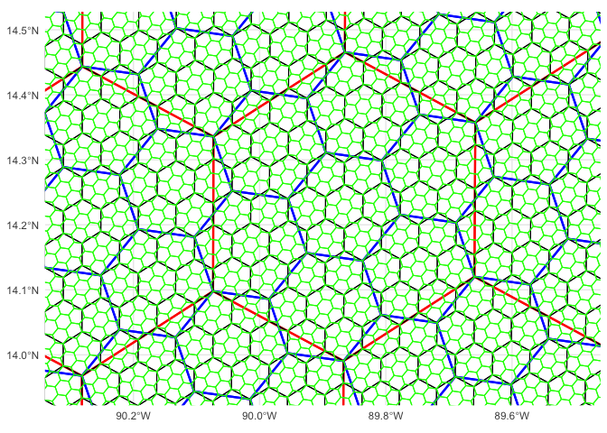

cahexgrids: hierarchical hexagonal geospatial grids for Central America
================

<!-- README.md is generated from README.Rmd. Please edit that file -->

# cahexgrids 

<!-- badges: start -->
<!-- badges: end -->

The goal of cahexgrids is to provides a hierarchical geospatial
hexagonal grid indexing system for Central America

Hexagonal grid resolution are 4, 5, 6, 7 y 8 (based in
[H3](https://h3geo.org)

## Installation

You can install the development version of cahexgrids from
[GitHub](https://github.com/) with:

``` r
# install.packages("devtools")
devtools::install_github("ManuelSpinola/cahexgrids")
```

## Example

This is a basic example which shows you how to use cahexgrids:

``` r
library(tidyverse)
library(sf)
library(cahexgrids)
```

``` r
ggplot(ca_hex_grid_res_4) +
  geom_sf(fill = "dodgerblue3", color = "gray") +
  theme_minimal()
```

<div class="figure">


<p class="caption">
Figure 1. Hexagonal grid of resolution 4 for Central America.
</p>

</div>

<br>

``` r
ggplot(ca_hex_grid_res_5) +
  geom_sf(fill = "dodgerblue3", color = "gray") +
  theme_minimal()
```

<div class="figure">


<p class="caption">
Figure 2. Hexagonal grid of resolution 5 for Central America.
</p>

</div>

<br>

``` r
ggplot(ca_hex_grid_res_6) +
  geom_sf(fill = "dodgerblue3", color = "gray") +
  theme_minimal()
```

<div class="figure">


<p class="caption">
Figure 3. Hexagonal grid of resolution 6 for Central America.
</p>

</div>

<br>

<div class="figure">


<p class="caption">
Figure 4. Hierarchical hexagonal grids of resolution 5, 6, 7, 8. Every
hexagonal cell has seven child cells below it in this hierarchy.
</p>

</div>
